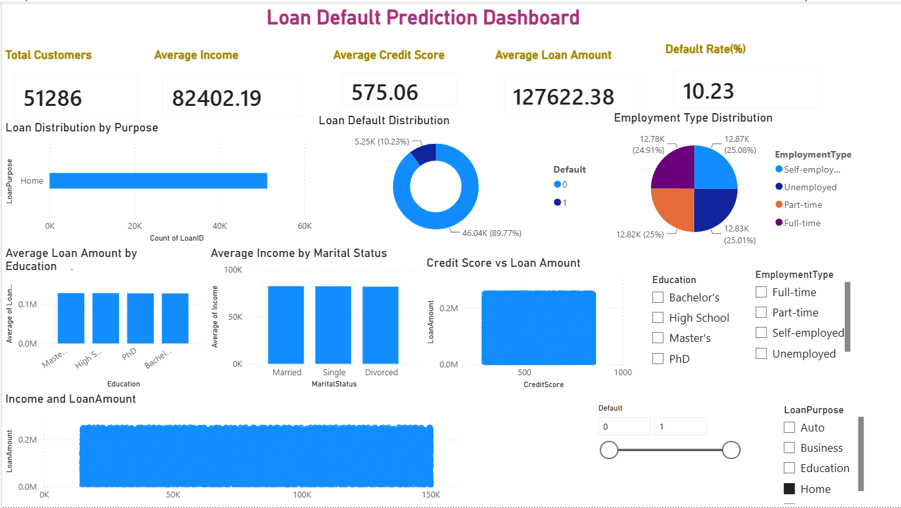

# 🏦 Loan Default Prediction System

A Machine Learning project that predicts whether a loan applicant is likely to default based on demographic and financial information. The project aims to help financial institutions assess credit risk and support informed lending decisions.

---

# 📌 Problem Statement

Loan defaults result in significant financial losses for banks and lending institutions. Manually evaluating every loan application is time-consuming and prone to human error.

This project uses machine learning to classify loan applicants as **high-risk** or **low-risk**, enabling faster and more reliable loan approval decisions.

---

# 🎯 Objectives

- Analyze loan applicant data
- Clean and preprocess the dataset
- Perform Exploratory Data Analysis (EDA)
- Train and evaluate machine learning models
- Predict loan default risk
- Visualize insights using Power BI

---

# 📂 Dataset

The dataset contains information about loan applicants, including:

- Applicant Income
- Loan Amount
- Credit History
- Employment Status
- Education
- Property Area
- Marital Status
- Loan Status

The dataset was cleaned and preprocessed before model training.

---

# 🛠️ Technologies Used

- Python
- Pandas
- NumPy
- Scikit-learn
- Matplotlib
- Jupyter Notebook
- Power BI

---

# ⚙️ Machine Learning Workflow

1. Data Collection
2. Data Cleaning
3. Exploratory Data Analysis (EDA)
4. Data Preprocessing
5. Feature Engineering
6. Model Training
7. Model Evaluation
8. Loan Default Prediction
9. Power BI Dashboard

---

# 📊 Model Performance

The model was trained to classify loan applicants into **Default** and **Non-Default** categories.

**Evaluation Metrics**

## 📊 Model Comparison

| Model | Accuracy | Precision | Recall | F1 Score | ROC-AUC |
|-------|---------:|----------:|--------:|---------:|---------:|
| Logistic Regression | 88.17% | 71.79% | 3.58% | 6.82% | **74.65%** |
| Decision Tree | 79.67% | 19.26% | **21.36%** | **20.25%** | 54.52% |
| Random Forest | 88.04% | **72.22%** | 1.66% | 3.25% | 71.73% |

**Selected Model:** Logistic Regression

Logistic Regression was selected as the final model because it achieved the best overall ROC-AUC score while maintaining competitive accuracy among the evaluated models.

---

# 📈 Project Features

- Data Cleaning and Preprocessing
- Exploratory Data Analysis
- Machine Learning Classification
- Loan Default Prediction
- Power BI Dashboard
- Business Insights

---

# 📷 Power BI Dashboard

> **Dashboard Preview**




---

# 🚀 Future Improvements

- Deploy the model using Streamlit
- Perform Hyperparameter Tuning
- Compare additional Machine Learning algorithms
- Add Explainable AI (SHAP)
- Connect to a real-time database

---

# 📁 Project Structure

```
Loan-Default-Prediction-System
│
├── loan_default_dataset.csv
├── loan_default_dashboard.pbix
├── loan_default_prediction.ipynb
├── project_report.pdf
├── requirements.txt
├── .gitignore
└── README.md
```

---

# 👨‍💻 Author

**Gracy**

GitHub: **https://github.com/G-R-A-C-Y**